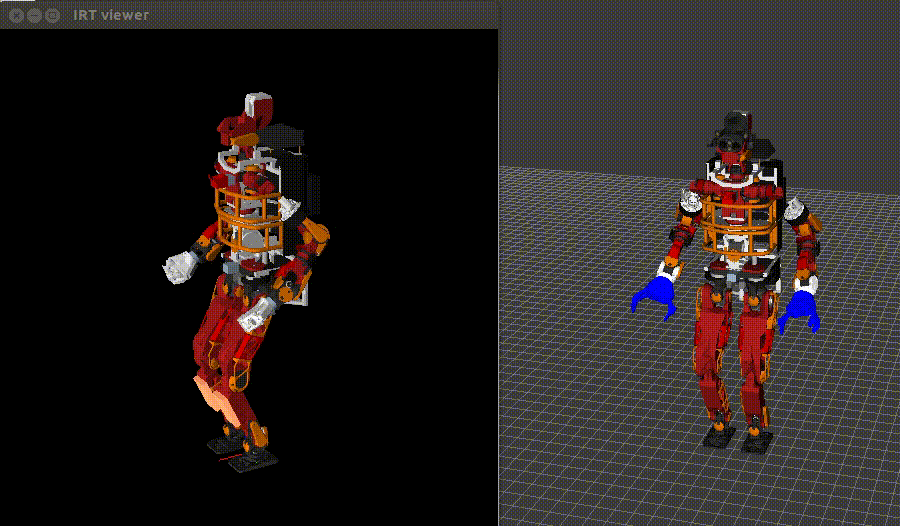
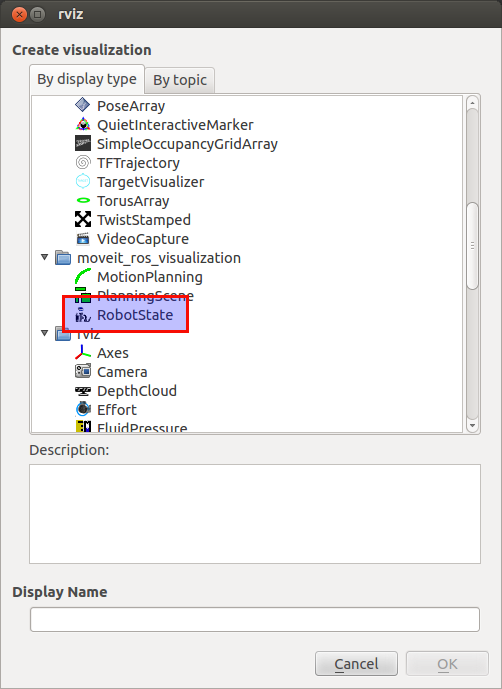

# `moveit_msgs/DisplayRobotState`を利用してrviz上にロボットを表示させる


rviz上に自由にロボットを配置し、可視化するには`moveit_msgs/DisplayRobotState`が便利です。
これを利用することで、関節角度+ルートリンク位置を指定することでロボットを可視化できます。

サンプルは`roslaunch jsk_interactive_marker display_robot_state_sample.launch`で確認できます。

`moveit_msgs/DisplayRobotState`を利用するためには、`moveit_ros_visualization`から`RobotState`を選択します.


この`RobotState`プラグインは2つのパラメータ、1つのトピックに依存します。
* parameter
  * `/robot_description`

    ロボットの形状を読むために、`robot_description`を必要とします。
  * `/robot_description_semantic`

    moveitで利用される、マニピュレータ情報等を保持するパラメータ。一般には`srdf`というファイルで管理されることが多い。
    仮想上院とを追加することができるため、これを利用してルートリンクに6自由度の仮想ジョイントを追加してrviz上にロボットを配置させる。
* topic
  * `Robot State Topic` (`moveit_msgs/DisplayRobotState`)

    トピック名はプラグインのフォームで設定可能。

ロボットのルートリンクを指定するため、以下のような`srdf`を`/robot_description_semantics`に設定する必要があります。

```xml
<?xml version="1.0" ?>
<robot name="JAXON_RED">
    <virtual_joint name="world_joint" type="floating" parent_frame="odom" child_link="BODY" />
    <passive_joint name="world_joint" />
</robot>
```

このsrdfはmoveitでのプランニングを行うためには情報が少なすぎますが、可視化には十分です。
このような`srdf`を自動的に設定するためのスクリプトが
[package://jsk_interactive_marker/scripts/semantic_robot_state_generator.py](https://github.com/jsk-ros-pkg/jsk_visualization/blob/master/jsk_interactive_markers/jsk_interactive_marker/scripts/semantic_robot_state_generator.py)
として提供されています。

このスクリプトで設定される`srdf`は`world_joint`という仮想ジョイントがルートリンクとオドメトリ原点との間に設定されます。
これはmoveit標準の命名則と一致しているため、moveit_configで生成したsrdfを`semantic_robot_state_generator.py`の代わりに用いることもできます。

`euslisp`から`moveit_msgs/DisplayRobotState`を生成する関数として`angle-vector-to-display-robot-state`が[package://jsk_interactive_marker/euslisp/display-robot-state.l](https://github.com/jsk-ros-pkg/jsk_visualization/blob/master/jsk_interactive_markers/jsk_interactive_marker/euslisp/display-robot-state.l)にて提供されています。
これを用いると、以下のようにしてrviz上にロボットを可視化できます。

```lisp
(load "package://hrpsys_ros_bridge_tutorials/euslisp/jaxon_red-interface.l")
(setq *robot* (instance jaxon_red-robot :init))
(send *robot* :fix-leg-to-coords (make-coords))
(ros::roseus "foo")
(ros::advertise "/robot_state" moveit_msgs::DisplayRobotState)
(ros::publish "/robot_state" (angle-vector-to-display-robot-state *robot* (send (send *robot* :link "BODY") :copy-worldcoords)))
```

## 注意点
rvizで`RobotState`を追加する前に`robot_description_state`が設定されている必要があります。
そうでないと、ルートリンクの表示がおかしくなります。
