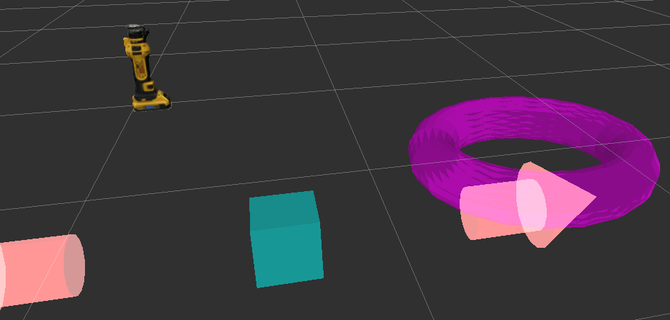

# transformable_server_sample


`transformable` provides interactive marker to control some object models.

## Parameters
* `~server_name`
  Name of nteractive server.

* `~use_parent_and_child` (default: `false`)
  Use `ParentAndChildInteractiveServer`

** if true, you can use associate markers like this
```
rosservice call /simple_marker/set_parent_marker "parent_topic_name: ''
parent_marker_name: 'drill'
child_marker_name: 'hand'"
```
*** if parent_topic_name==empty, it uses self server.
*** only 1 hierarchy is supported

## Usage

```
roslaunch jsk_interactive_marker urdf_model_marker.launch
```
then, in different terminal
You can insert box marker by this command
```
rosservice call /simple_marker/request_marker_operate "operate: {type: 0, action: 0, frame_id: '', name: '', description: '', mesh_resource: '',
  mesh_use_embedded_materials: false}"
```

You can insert model by this command
```
rosservice call /simple_marker/request_marker_operate "operate: {type: 3, action: 0, frame_id: 'map', name: 'hand', description: '', mesh_resource: 'package://hrpsys_ros_bridge_tutorials/models/HRP3HAND_R_meshes/RARM_LINK6_mesh.dae',
  mesh_use_embedded_materials: true}" 
```


## Topics
You can control markers through topics below
(Please Read msg Structure by rosmsg show or some other)
(The default topic name is /simple_marker, server name is the same)
 * /simple_marker/set_color
 * /simple_marker/feedback [visualization_msgs/InteractiveMarkerFeedback]
 * /simple_marker/set_radius
 * /simple_marker/set_control_relative_pose
 * /simple_marker/add_pose_relative [geometry_msgs::Pose]
 * /simple_marker/set_z
 * /simple_marker/set_x
 * /simple_marker/set_y
 * /simple_marker/add_pose [geometry_msgs::Pose]
 * /simple_marker/set_control_pose [geometry_msgs::PoseStamped]
 * /simple_marker/set_pose [geometry_msgs::PoseStamped]

You can get marker info by topics below
 * /simple_marker/marker_dimensions [jsk_interactive_marker/MarkerDimensions]
 * /simple_marker/pose [geometry_msgs/PoseStamped]
 * /simple_marker/focus_object_marker_name [std_msgs/String]
 * /simple_marker/pose_with_name [jsk_interactive_marker/PoseStampedWithName]
 * /simple_marker/focus_marker_name_text [jsk_rviz_plugins/OverlayText]
 * /tf [tf2_msgs/TFMessage] (with marker name, tf is published)
 * /simple_marker/focus_marker_pose_text [jsk_rviz_plugins/OverlayText]

## Services
You can control markers through topics below
 * /simple_marker/request_marker_operate -> for inserting marker
 * /simple_marker/set_focus
 * /simple_marker/set_color
 * /simple_marker/set_control_pose
 * /simple_marker/set_parameters
 * /simple_marker/set_pose
 * /simple_marker/set_dimensions
 * /simple_marker/set_parent_marker
 * /simple_marker/hide

You can get marker info through topics below
 * /simple_marker/get_control_pose
 * /simple_marker/get_color
 * /simple_marker/get_focus
 * /simple_marker/get_dimensions
 * /simple_marker/get_type
 * /simple_marker/get_pose
 * /simple_marker/get_existence


