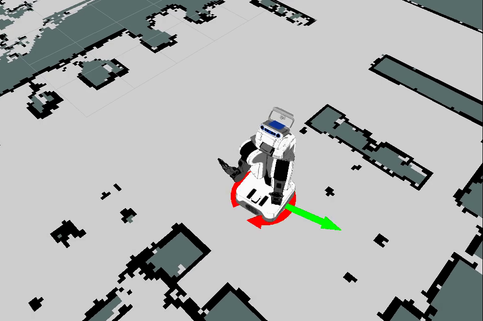
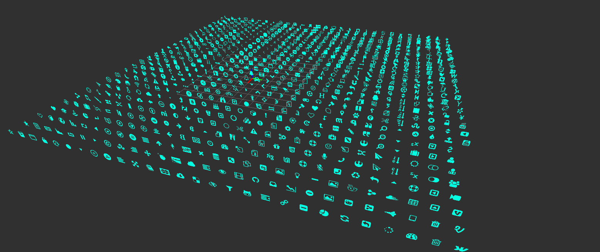
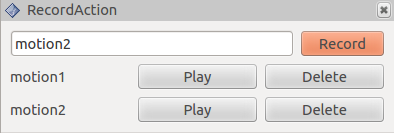
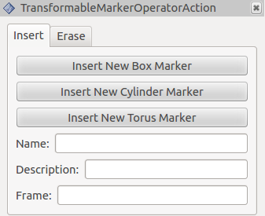

# jsk\_rviz\_plugins

## Introduction
jsk\_rviz\_plugins is a package to provide original rviz plugins.

You can use this rviz plugins just launch rviz.

## rviz\_plugins

### Displays
#### AmbientSound
#### Diagnostics
#### FootStep
#### Normal

This will show the Normal which is subcribed from topic (sensor_msgs::PointCloud2).
The normal is assumed to have the features x,y,z,normal\_x,normal\_y,normal\_z.


##### Samples
Plug the depth sensor which could be launched by openni.launch and execute below command.

```
roslaunch jsk_rviz_plugins normal_sample.launch
```

#### [TwistStamped](http://youtu.be/Q-I5Vx_4VHk)


[Movie](http://youtu.be/Q-I5Vx_4VHk)

Visualize `geometry_msgs/TwistStamped` by arrows. Linear velocity is represented by one arrow
and angular velocity is represented by 3 arrows for each axis.

##### Properties
* linear scale (default: `1.0`)
* angular scale (default: `1.0`)

  Scale factor of size of arrows

* linear color (default: `RGB(0, 255, 0)`)
* angular color (default: `RGB(255, 0, 0)`)

   Color of arrows

##### SimpleOccupancyGridArray


Visualize `jsk_recognition_msgs/SimpleOccupancyGridArray`.

------

#### OverlayText
#### PieChart
#### Plotter2D
##### What Are These


These will show text or graph on the rviz main view.


##### Samples

Just run below commands

```
roslaunch jsk_rviz_plugins overlay_sample.launch
```

---

#### PolygonArray


Visualize `jsk_recognition_msgs/PolygonArray` message

##### Properties
* `Topic`

  Name of topic of `jsk_recognition_msgs/PolygonArray`
* `auto color`

  If it's true, color of polygons are automatically changed
* `Color`

  Color of polygons, only enabled if `auto color` is false
* `Alpha`

  Transparency of polygons
* `only border`

  Draws only edges of polygons.
* `show normal`

  Show normal of polygons.
* `nromal length`

  Lenght of normal [m].

#### TorusArray


Visualize `jsk_pcl_ros/TorusArray` message

##### Properties
* `Topic`

  Name of topic of `jsk_pcl_ros/TorusArray`
* `auto color`

  If it's true, color of polygons are automatically changed
* `Color`

  Color of polygons, only enabled if `auto color` is false
* `Alpha`

  Transparency of polygons
* `uv-smooth`

  Smoothness the surface
* `show normal`

  Show normal of toruses.
* `nromal length`

  Lenght of normal [m].


#### Pictogram


[movie](https://www.youtube.com/watch?v=AJe1uQupsUE)

Pictogram is a rviz plugin to visualize icons.
Pictogram plugin uses [Entypo](http://entypo.com/) and [FontAwesome](http://fortawesome.github.io/Font-Awesome/).

You need to use `jsk_rviz_plugins/Pictogram` message to use it.

You can find mapping with `character` and icons at [here](http://fortawesome.github.io/Font-Awesome/icons/) and [here](http://entypo.com/characters/).

### Panels
#### CancelAction


This will publish action_msg/GoalID to `topic_name`/cancel.
You can choose multiple cancel goals.

#### RecordAction


This will publish jsk_rviz_plugins/RecordCommand to /record_command.
Set the target name.

#### EmptyServiceCallInterfaceAction
#### ObjectFitOperatorAction


This will publish jsk_rviz_plugins/ObjectFitCommand to /object_fit_command".
If you check `reversed`, the reversed version will publish.

#### PublishTopic


This will publish std_msgs/Empty to the topic you designate.
#### RobotCommandInterfaceAction


This will call service to /eus_command with jsk_rviz_plugins/EusCommand srv.

#### SelectPointCloudPublishAction


This will publish sensor_msgs/PointCloud2 to /selected_pointcloud.
1. First, push `Select`Button and select the pointcloud region(Note that you need to choose only pointcloud. Don't include other parts).
2. Secord, push the SelectPointCloudPublishAction button.
3. Then the selected pointcloud will be published.

#### TransformableMarkerOperatorAction



This will call service to /request_marker_operate to insert/erase transformable_object
